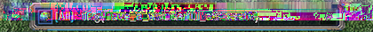
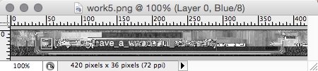
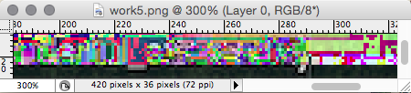

# Forensics (150 pts)
We received this PNG file, but we're a bit concerned the transmission may have not quite been perfect.

File: http://play.plaidctf.com/files/corrupt_735acee15fa4f3be8ecd0c6bcf294fd4.png

---

## Solution

1. Opening the file in hex editor immediately revealed that the header was missing the 5th bit in the header (0x0D). After we added it, the file became partially readable ([see work1.png](work1.png)).

2. However, the IDAT chunks were all corrupted. Some had extra bytes, others had 1-3 bytes missing. To even get the viewer to proceed to the next chunk we had to make sure that the previous one contained a correct CRC. A simple C program based on http://www.libpng.org/pub/png/spec/1.1/PNG-CRCAppendix.html allowed to insert corrected CRC sums.

3. We also noticed, that adding the missing bytes was somewhat restoring the picture, to the point that it would be easy to spot if there was any text in it ([see work3.png](work3.png)).

4. But that didn't help much, because the actual flag was scrambled severely in the resulting image ([see work4.png](work4.png)). We created a screenshot on the resulting image and opened it in Photoshop: 

5. Junk, right? But not if you look carefully at the blue channel! 

Yes, that's right... you see the itail of letter "g", the curly blraces and the words "have_a_.....". Now if we could only figure out what those words are! Ok, the third word looks something like... "wonderful"!

6. We still needed the last word. By this time I was already almost swearing and my eyes were hurting from staring too hard at that bright visual noise... The word had to be about 7-9 letters long. The name of the game from which the screenshot was taken? Google says it's StarCraft. The first two letters of the word do ineed look like "st". And look at those thin shades at the bottom of the text! 

They are like Morse code... and they fit "starcraft" exactly, plus one more letter! The remaining letter has a mid-size footprint, wider than "t", larrower than "o"... must be an "s"!

7. And *flag{have_a_wonderful_starcrafts}* it is! :)
